<h1 align="center">MD Suweb Reza</h1>

  <strong>Forward Deployed Engineer · Applied AI &amp; Full-Stack</strong> 
  Bengaluru, India · Remote · US / EU / GCC hours

<em>I work embedded with clients: I turn what their departments need into working AI systems, and stay on the hook once those systems are live.</em>

  <picture>
    <source media="(prefers-color-scheme: dark)" srcset="assets/stack-dark.svg">
    
  </picture>

  <strong>6</strong> products &nbsp;·&nbsp; <strong>18+</strong> repositories &nbsp;·&nbsp; <strong>1,450+</strong> commits &nbsp;·&nbsp; <strong>73%</strong> of days in client contact

 

<strong>Two problems I would want to be judged on</strong>

 

**272 queries down to 7.** A read path in a live accounting product. An N+1 that a tree structure multiplied, where the column in question is a native Postgres enum, so the usual bulk shortcut was unavailable. The fix had to come out of the read path itself.

**A connection pool that was never reused.** Recurring 500s in a live financial core, not reproducible on demand. Persistent connections are normally an optimization; under ASGI every request lands on a fresh thread, so they leak rather than get reused. I measured it instead of assuming, found reuse was exactly zero, and the payments path came back.

<strong>Open source</strong>

 

**[reza](https://github.com/swebreza/reza)** gives Claude, Cursor, Codex and Aider one shared project memory, so switching assistants stops meaning re-explaining the codebase.

 

  Building <strong>HiringTree</strong> at Hiretree Labs. 
  Open to forward deployed and applied AI engineering roles, remote.

  <a href="https://suweb-mu.vercel.app/">Portfolio</a> &nbsp;·&nbsp;
  <a href="https://linkedin.com/in/suwebreza/">LinkedIn</a> &nbsp;·&nbsp;
  <a href="mailto:swebreza@gmail.com">swebreza@gmail.com</a>

