# MD Suweb Reza

**Founding Engineer · Full-Stack Product Engineer**

Bengaluru, India. Remote, working US, EU and GCC hours.

I ship whole products alone, from data model to deployed URL to first user.

---

### Last six months

**6** verticals · **17** repositories · **1,350+** commits · **Mar to Aug 2026**

Accounting and fintech, hiring, health tech, insurance, business identity, and private-market intelligence. Backend, frontend, data model, infrastructure and the deploy pipeline in every case.

<picture>
  <source media="(prefers-color-scheme: dark)" srcset="assets/commits-dark.svg">
  
</picture>

The verticals were not sequential. Four of them overlapped, which is the part that is hard to do alone:

<picture>
  <source media="(prefers-color-scheme: dark)" srcset="assets/timeline-dark.svg">
  
</picture>

Most of this lives in private and client repositories, so it does not show up on this profile. The [ship log](https://suweb-mu.vercel.app/#ship-log) breaks down each product, the hardest problem in it, and the command that verifies the totals. Both charts above are generated from that same git data by [`assets/generate.py`](assets/generate.py).

---

### Two problems I would want to be judged on

**272 queries down to 7.** The chart-of-accounts read path in a live accounting product. An N+1 that the tree structure multiplied, and the account type is a native Postgres enum, so the usual bulk shortcut was unavailable. The fix had to come out of the read path itself.

**A connection pool that was never reused.** Recurring 500s in a live financial core, not reproducible on demand. Persistent connections are normally an optimization; under ASGI every request lands on a fresh thread, so they leak rather than get reused. I measured it instead of assuming, found reuse was exactly zero, and the payments path came back.

---

### Stack

- **Backend** Python · Django · DRF · FastAPI · Celery · Django Channels
- **Frontend** TypeScript · React · Next.js · React Native / Expo
- **Data** PostgreSQL · pgvector · Redis · multi-tenant schema design
- **Cloud** GCP · Cloud Run · Cloud Build · Docker · GitHub Actions
- **AI** Gemini · OpenAI · embeddings · vector search · RAG

---

### Open source

**[reza](https://github.com/swebreza/reza)** gives Claude, Cursor, Codex and Aider one shared project memory, so switching assistants stops meaning re-explaining the codebase.

---

### Now

Building **HiringTree** at Hiretree Labs: a multilingual workforce-mobility platform connecting workers, agencies and employers across South Asia and the GCC.

Open to founding engineer and senior full-stack roles, remote.

[Portfolio](https://suweb-mu.vercel.app/) · [LinkedIn](https://linkedin.com/in/suwebreza/) · swebreza@gmail.com
